# Projeto App Emel - Computação Móvel 23/24

Mariana Carvalho - a22001926

## Descrição da Arquitetura da Aplicação
Frontend:
O uso de componentes reutilizáveis facilita a manutenção e a escalabilidade, ou seja, o menu é implementado uma so vez de modo a nao haver copia de codigo desnecessaria.
As tecnologias usadas foram a AppBar e a BottomNavBar 

Backend:
O uso de injeção de dependencias e do provider facilita a escalabilidade e o desenvolvimento paralelo, além de permitir a implementação independente de cada serviço.
E o uso APIs e Base de dados em SQL facilitam a comunicação entre o frontend e o backend

Problema lugares negativos: quando apresenta lugares negativos assumimos que o parque está lotado, pois assumimos a sobrelotação do parque.

## Prints e descrições
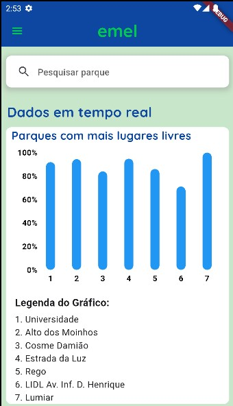
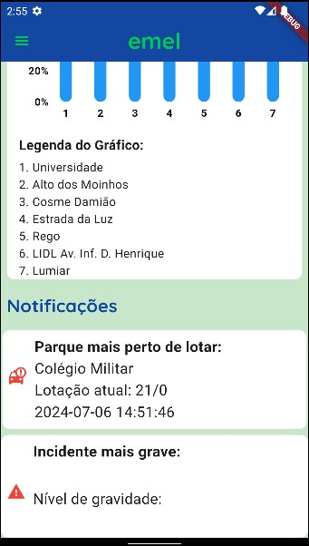

O modelo de navegação usado foi trasiente, o toggle menu de modo a permitir mais opções de menu sem ocupar espaço útil para informação mais importante.

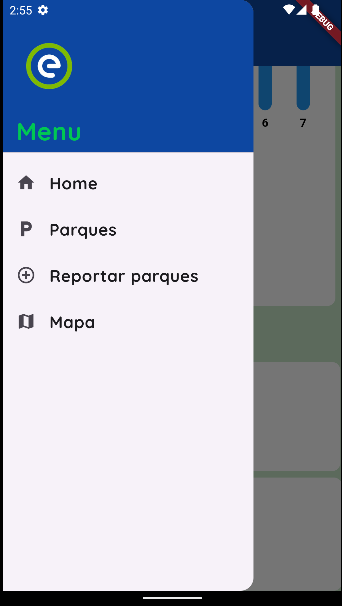

Temos uma barra de pesquisa que nos permite de forma rapida e eficaz pesquisar o porque pelo nome.
Introduzimos na dashboard um gráfico que nos mostram taxa de ocupação dos 7 parque, com mais lugares livres.
Colocamos ainda uma área de Notificações que nos indica o parque mais perto de lotar e incidente mais grave (que tenha sido previamente registado na base de dados).

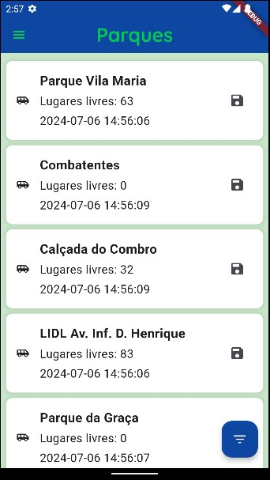

Na lista de parques, introduzimos cada parque com o nome do parque, a sua lotação e a ultima atualização da lotação tudo vindo da API. Colocamos ainda um botão de filtros, que não conseguimos finalizar. O print dos filtros da lista de parques fica abaixo.

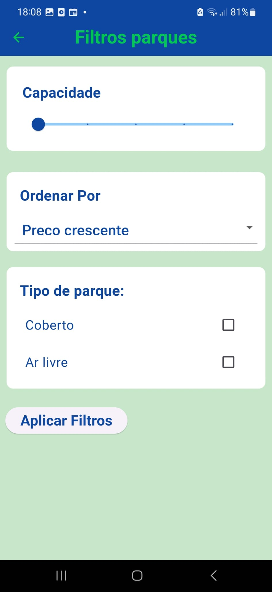

Clicando em cada parque conseguimos visualizar o detalhe de cada parque, onde conseguimos ver o tipo de estrutura, capacidade, nome do parque e lugares ocupados. Em baixo, temos a lista de incidentes vindos da base de dados de cada parque e um botão de filtros para os incidentes (que também não ficou a funcionar)

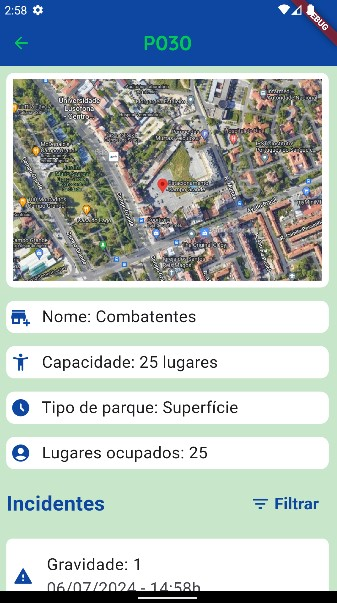
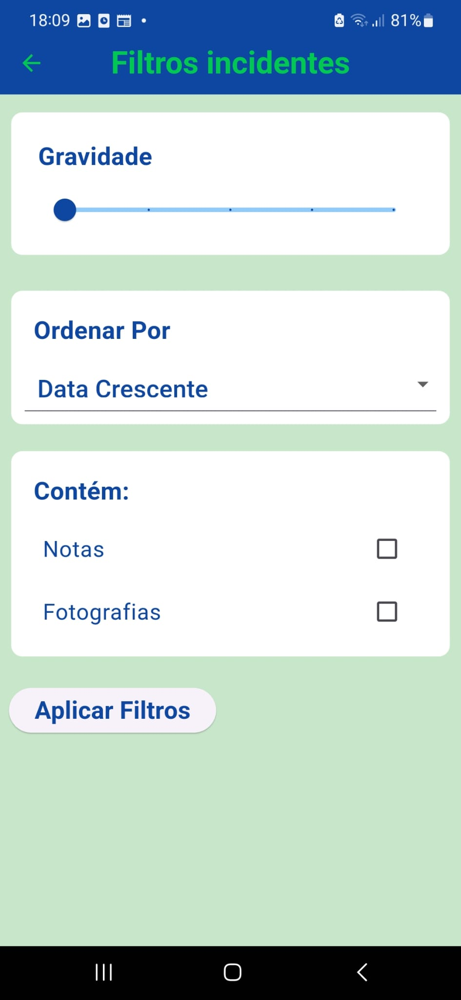

Clicando em cada detalhe, temos também um ecrã de detalhe para cada incidente vindo da base de dados.

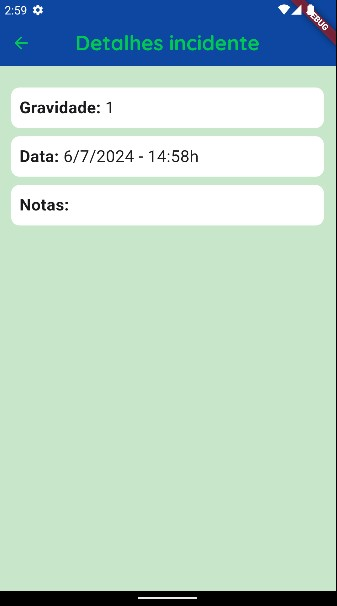

Aqui conseguimos ver o ecrã de Report, em que não é possivel submeter o report enquanto os campos nome do parque, gravidade, hora e data estiverem preenchidos. os dados submetidos sao guardados na base de dados.

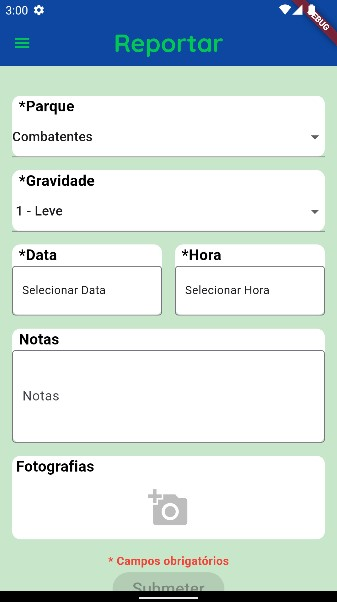

Conseguimos visualizar aqui o ecrã do mapa, onde apresenta a nossa localização atual e os parques disponiveis a volta, identificados por um marker, onde carregando no mesmo é possivel ver os detalhes do parque.

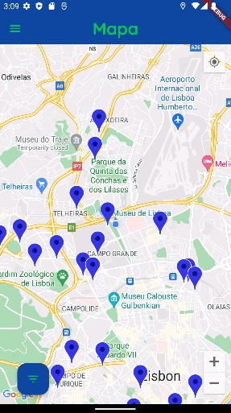

## gira

No mapa existe um botão onde é possivel escolher entre parques e estações de gira.

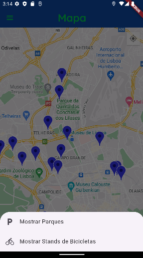

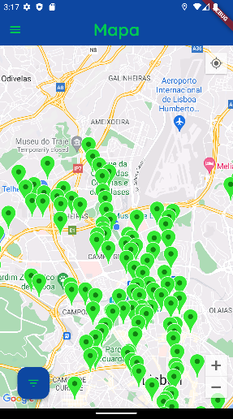

Carregando num marker temos acesso aos detalhes da estação escolhida.

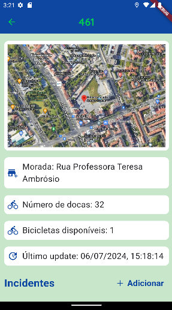

Dentro da página de detalhes é possível adicionar um incidente.

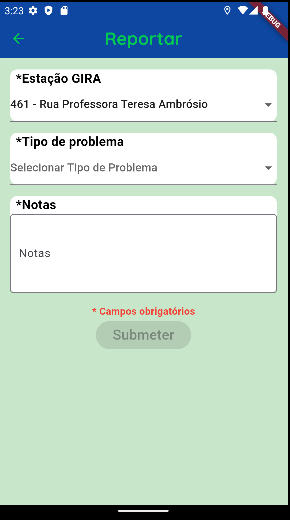

Após adicionar o incidente, o mesmo é apresentado na lista de incidentes na página de detalhes da estação gira correspondente.

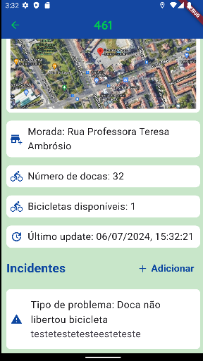

## link
https://youtu.be/JjvJ04QzLPE

De acordo com o que realizamos no projeto, a nossa autoavaliação é 16.
